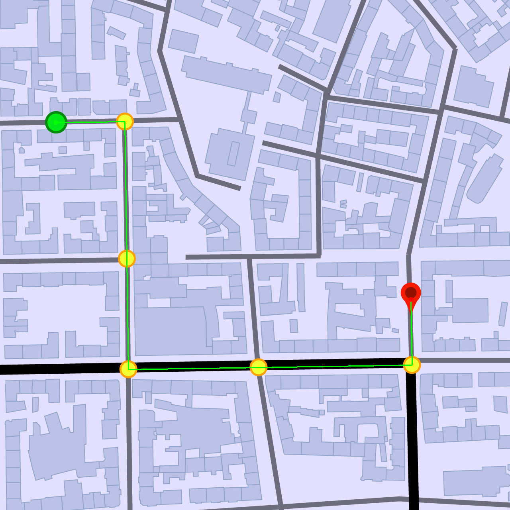
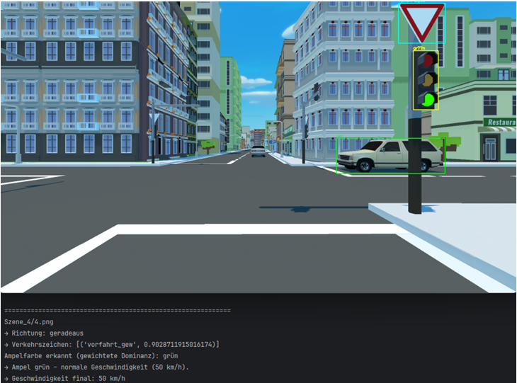
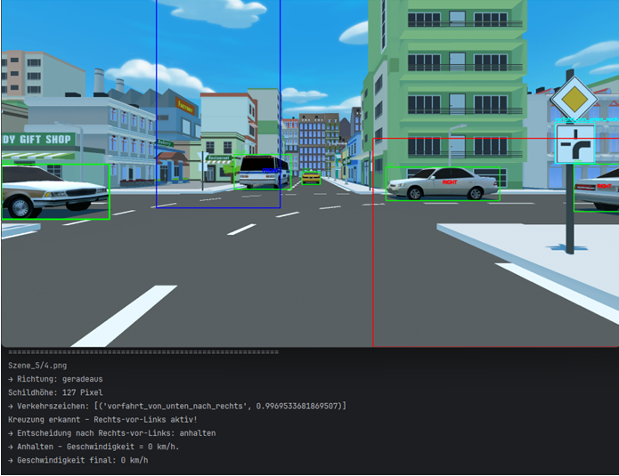

# Traffic Analysis – Digitale Bildverarbeitung

## 📂 Projektübersicht

Dieses Projekt analysiert eine Reihe von Bildern, die verschiedene Verkehrssituationen darstellen.  
Der Algorithmus bestimmt für jedes Bild:

- **Geschwindigkeit:** 0, 10, 30, 50 km/h  
- **Richtung:** links, rechts, geradeaus  

Der Algorithmus berücksichtigt Verkehrsregeln, Straßenschilder (30er/50er Zonen), Kontextinformationen und Objekte in den Bildern. Die Ergebnisse werden in der Datei `solution.json` gespeichert.

## 🧠 Methodik

- Vorverarbeitung der Bilder (z. B. Graustufen, Filter)  
- Erkennung von Fahrbahnmarkierungen, Ampeln und Verkehrszeichen  
- Anwendung von Verkehrsregeln zur Entscheidung über Geschwindigkeit und Richtung  
- Umgang mit schwierigen Szenen (z. B. Hindernisse, schlecht sichtbare Schilder)  

<table>
  <tr>
    <td></td>
    <td></td>
  </tr>
  <tr>
    <td></td>
    <td></td>
  </tr>
</table>

## Nutzung / Ausführung

1. `python main.py` ausführen  
2. Alle Szenen werden automatisch bearbeitet  
3. Ergebnisse werden in `solution.json` gespeichert  

## Herausforderungen

- Erkennung von schwer sichtbaren oder reflektierenden Verkehrszeichen  
- Entscheidungen bei mehreren gleichzeitig auftretenden Objekten  
- Optimierung der Geschwindigkeit und Richtung in schwierigen Szenen  

## 📞 Zugang

Dieses Repository zeigt nur die Projektbeschreibung, ausgewählte Screenshots und Beispielausgaben.
Der vollständige Code und alle Daten bleiben privat und sind nicht öffentlich einsehbar.
**Zweck:** Dieses Repository dient als Portfolio-Referenz, um die angewandten Methoden und Ergebnisse zu demonstrieren.

